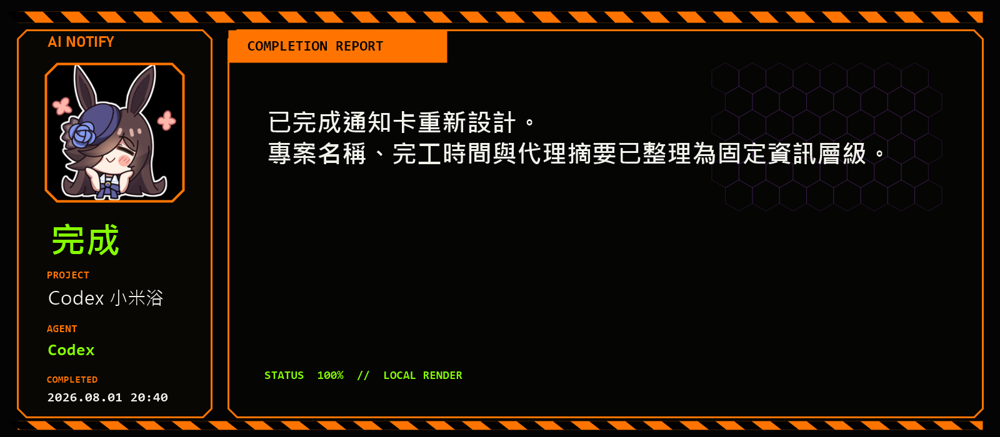

# Codex Discord Webhook Notify

這是一個 Codex `notify` handler。Codex 對話回合完成時，腳本會接收 `agent-turn-complete` 事件，在本機產生固定格式的 PNG 通知卡，再透過 Discord webhook 通知指定使用者。

這個專案只做 event-driven notification，不做排程輪詢，也不掃描專案狀態。

## 功能

- 接收 Codex `notify` 事件：`--codex-notify`
- 支援完成、待核准、失敗、用量不足、需人工確認等狀態判斷
- 自動忽略 Codex Desktop 內部 title generation / ambient suggestions 事件
- 保留原始 Codex event log 到 `.state/events/*.jsonl` 方便校準
- 使用現有米浴角色圖片，依狀態在本機產生紅黑警戒風格通知卡
- 優先擷取代理自己標記的摘要段（`摘要：` / `SUMMARY:` / `結論：`），沒有標記才退回最終回覆前兩行
- 可由設定切換通知主題，目前提供 `eva` 與 `galgame`
- 支援固定格式與轉發 notify command

## 通知格式

所有 agent 共用同一張固定格式通知卡：

```text
狀態 | 專案名稱 | 回應代理 | 完工時間（Asia/Taipei）
使用者要求
精簡結果
```

不顯示自動產生的對話名稱，改顯示該回合最新一則有效的使用者要求；Codex event 含有完整 `input-messages` 歷史時，通知器會取最後一則。卡片採 1000×1400 直式版面，高度是原本兩倍，方便手機查看。卡片會標示實際回應代理（例如 Codex 或 Claude）。**濃縮摘要由代理自己產生**：代理在最終回覆放一個標記段落（`摘要：` 或 `SUMMARY:`，可單行或起一段），通知器擷取該段前兩行；沒有標記時退回最終回覆前兩行。通知器只做確定性擷取與排版，不會再次呼叫 AI。完整原始事件仍寫入 `.state/events/*.jsonl`。

### 助手風格（米浴語氣）

摘要的語氣由代理自己決定，通知器不改寫也不呼叫 AI。要讓卡片顯示米浴風格，在代理指示（Codex `AGENTS.md` / Claude `CLAUDE.md`）要求它在回合結尾寫一段 `摘要：`：語氣輕、帶米浴怯生生的口吻（「那個...」「米浴...」「請你看一下...」），但結論仍要具體。摘要有 108 字上限，賣萌綴詞請節制，別擠掉實際結果。例：

```text
摘要：那個...改好通知卡摘要擷取了，米浴把結果放在這裡...
測試 8/8、eval 10/10 都通過了，請你看一下...
```

想要中性語氣，把米浴綴詞拿掉即可，`摘要：` 標記與擷取格式不變。

實際卡片採工業識別牌（industrial plate）方向：上方是米浴、狀態、代理與專案資訊，下方依 4:6 比例排列 `USER REQUEST` 與 `COMPLETION REPORT`。滿版背景使用實心警戒紅六角、粗黑分隔、`EMERGENCY` 與交錯三角符號，並固定隨機挑選約 15% 六角顯示為暗紅未點亮狀態；主要內容覆蓋高不透明度黑玻璃漸層，維持手機閱讀對比。



## 檔案

```text
scripts/discord-notify.mjs     Codex notify handler
scripts/notification-themes/eva.ps1  EVA 主題 PNG 渲染器
config/discord.example.json    設定範例，可複製成本機設定
data/riceshower_stamp/*.png    米浴表情包素材
```

本機 secret 設定檔 `config/discord.local.json` 不應提交到 GitHub，已由 `.gitignore` 排除。

## 設定

複製範例設定：

```powershell
Copy-Item config\discord.example.json config\discord.local.json
```

填入你的 Discord webhook 與 user id：

```json
{
  "webhookUrl": "https://discord.com/api/webhooks/...",
  "mentionUserId": "123456789012345678",
  "notificationTheme": "eva",
  "projectAliases": {
    "C:\\Users\\your-name\\Documents\\your-project": "我的專案"
  },
  "forwardNotifyCommand": []
}
```

`notificationTheme` 可用值為 `eva` 與 `galgame`，預設仍為 `eva`，舊設定不需修改。`galgame` 使用原始米浴狀態圖片、等寬手機聊天區、紫色角色標籤與單列視覺小說操作列；回覆文字以白字黑框直接融入紫色漸層，不顯示獨立回覆框。左上角顯示專案名稱，狀態框可完整容納 `用量不足`，代理標籤可完整容納 `Antigravity 小米浴`。兩個 renderer 讀取相同卡片資料契約：狀態、專案、代理、完成時間、使用者要求、結果與角色圖片路徑。

啟用 Galgame 主題：

```json
{
  "notificationTheme": "galgame"
}
```

### 新增通知主題

1. 複製 `scripts/notification-themes/eva.ps1` 作為新 renderer，或自行建立接受 `-InputPath`、`-OutputPath` 的 PowerShell 腳本。
2. 從輸入 JSON 使用 `status`、`statusKey`、`project`、`agent`、`completedAt`、`request`、`result`、`avatarPath`，並將 PNG 寫至 `OutputPath`。
3. 在 `scripts/discord-notify.mjs` 的 `notificationThemeRenderers` 登記主題名稱與腳本路徑。
4. 將 `config/discord.local.json` 的 `notificationTheme` 改成新名稱。
5. 執行下方 gate tests、eval 與 `--preview` 命令確認輸出。

通知資料擷取、Discord payload 與發送流程由共用 handler 負責；新主題只處理 PNG 視覺，不應重做事件解析或 webhook 邏輯。

## Codex Notify

把 Codex user-level config 設成呼叫這個腳本。Windows 範例：

```toml
notify = ["node", "C:\\Users\\your-name\\Documents\\codex-discord-webhook-notify\\scripts\\discord-notify.mjs", "--codex-notify"]
```

設定完成後重開 Codex App，讓 user-level `notify` 生效。

## Claude Code Notify

Claude Code（CLI 與桌面 App 共用 `~/.claude/settings.json`）在任務完成或需要確認時，會透過 hook 呼叫同一個通知卡渲染流程。

在 `~/.claude/settings.json` 加入 hook（Windows 範例）：

```json
{
  "hooks": {
    "Stop": [
      {
        "hooks": [
          {
            "type": "command",
            "command": "node \"C:\\Users\\your-name\\Documents\\codex-discord-webhook-notify\\scripts\\discord-notify.mjs\" --claude-notify --agent claude",
            "async": true
          }
        ]
      }
    ],
    "Notification": [
      {
        "hooks": [
          {
            "type": "command",
            "command": "node \"C:\\Users\\your-name\\Documents\\codex-discord-webhook-notify\\scripts\\discord-notify.mjs\" --claude-notify --agent claude",
            "async": true
          }
        ]
      }
    ]
  }
}
```

- `Stop`：Claude 回合結束 → `完成`（`completed`）
- `Notification`：Claude 需要權限或確認 → `待核准`（`needs_approval`）

`--claude-notify` 會讀取 Claude Code hook 的 stdin JSON（`hook_event_name`、`cwd`、`transcript_path`），並從 transcript 取出最後一則助理回覆作為結果。只有 `Stop` / `SubagentStop` / `Notification` 事件會發送通知，其餘 hook 會被忽略。

模擬 Claude 完成事件：

```powershell
node scripts/discord-notify.mjs --claude-notify '{"hook_event_name":"Stop","cwd":"C:/Users/your-name/Documents/your-project","session_id":"demo"}' --dry-run
```

## 測試

產生實際 PNG 預覽，不送 Discord：

```powershell
node scripts/discord-notify.mjs --test --dry-run --preview data\notification-preview.png
```

Galgame 主題預覽：先將本機 `config/discord.local.json` 的 `notificationTheme` 設為 `galgame`，再執行：

```powershell
node scripts/discord-notify.mjs --test --dry-run --preview .state\galgame-notification-preview.png
```

執行 gate tests 與通知格式 eval：

```powershell
node --test scripts\discord-notify.test.mjs
node evals\notification-contract.mjs
```

送出一則測試通知：

```powershell
node scripts/discord-notify.mjs --test
```

模擬 Codex 完成事件：

```powershell
node scripts/discord-notify.mjs --codex-notify '{"type":"agent-turn-complete","cwd":"C:\\Users\\your-name\\Documents\\your-project","thread-id":"thread-001","last-assistant-message":"notify dry run"}' --dry-run
```

## 公開前注意

- 不要提交 `config/discord.local.json`
- 不要提交 `.state/`
- 不要把 Discord webhook URL 放進 README、issue、commit message 或 prompt
- 如果 webhook 曾經暴露，請到 Discord 重新產生 webhook URL

## 素材聲明

米浴表情包來自 [是我祭祭哒](https://space.bilibili.com/9369485?) 公開之表情包。
